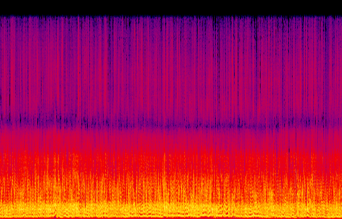
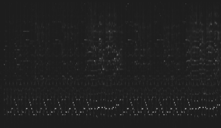
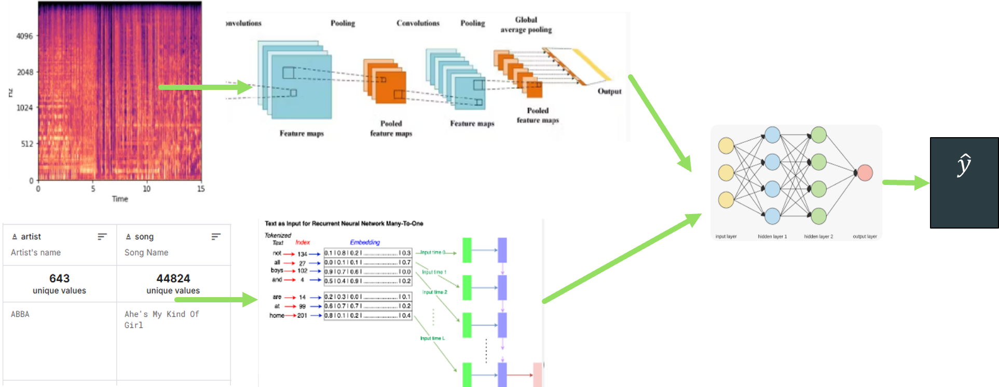
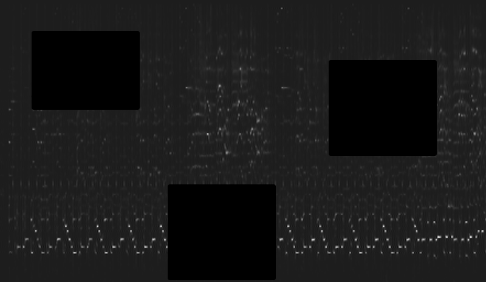
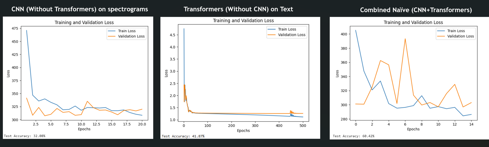
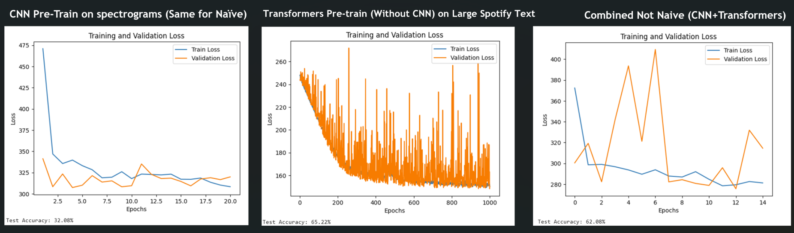
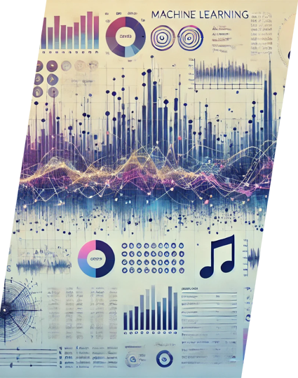

# Songs Popularity Prediction using Spectrograms and Textual Metadata

This project aims to predict song popularity using a multi-modal approach, combining audio spectrograms processed with Convolutional Neural Networks (CNN) and textual metadata processed using Transformer-based models. 

  

## Table of Contents

1. [Overview](#overview)
2. [Datasets](#datasets)
3. [Challenges and Solutions](#Challenges and Solutions)
4. [Model Architecture](#model-architecture)
    1. [CNN for Spectrograms](#cnn-for-spectrograms)
    2. [Transformers for Textual Metadata](#transformers-for-textual-metadata)
    3. [Feature Fusion](#feature-fusion)
5. [Training Approach](#training-approach)
    1. [Naive Approach](#naive-approach)
    2. [Better Approach](#better-approach)
6. [Training Details](#training-details)
7. [Preliminary Results](#preliminary-results)
8. [Conclusions](#conclusions)

## Overview

This repository contains the implementation for predicting song popularity using a combination of audio features (spectrograms) and textual metadata. A Convolutional Neural Network (CNN) is used to extract features from audio spectrograms, while a Transformer network processes metadata (artist name, song name, and release year). The two model outputs are then fused for a combined prediction.

## Datasets

### 1. Billboard Hot 100 1960-2020 Spectrograms

- **Source:** [Kaggle - Billboard Hot 100 Spectrograms](https://www.kaggle.com/datasets/tpapp157/billboard-hot-100-19602020-spectrograms/code)
- **Details:** The dataset contains over 3,000 CWT (Continuous Wavelet Transform) spectrograms for the CNN model.
- **Spectrogram Properties:** 200 pixels per second, each spectrogram is approximately 30-40K in width.

### 2. Spotify Dataset (1921-2020, 600k+ Tracks)

- **Source:** [Kaggle - Spotify Dataset](https://www.kaggle.com/datasets/yamaerenay/spotify-dataset-19212020-600k-tracks)
- **Details:** The dataset includes metadata for songs, including artist name, song title, release date, and popularity, which are used as input for the Transformer model.

The datasets are merged to create a final dataset of ~3,000 samples, while excluding overlapping samples from the Spotify dataset.

## Challenges and Solutions

### Solution for Inconsistent Spectrogram Sizes

- **Down-sampling:** The spectrograms are down-sampled using FFT-interpolations to a **constant size of 1024x256 pixels**. This standardization ensures a consistent size across all samples while retaining important patterns and features.

### Solution for Small Spectrogram Dataset

- **Data Augmentation:** To enhance the dataset, **data augmentation techniques** are applied, including:
  - Adding random noise
  - Applying random cover patches to simulate missing portions of the spectrogram.

- **Training Transformer on Larger Textual Data:** The Transformer network is trained on a larger dataset consisting of textual metadata (without spectrograms), which enables it to learn more robust features and improve model performance.

### Example: Patches covering a down-sampled Spectrogram

## Model Architecture

### CNN for Spectrograms

- **Layers:**
  - Convolution + Pooling Layers
  - Batch Normalization (to stabilize training)
  - Dropout (to avoid overfitting)
  - Fully Connected (FC) Layers
  
### Transformers for Textual Metadata

- **Input:** Tokenized metadata (artist name, song title, and release year).
- **Transformer Encoder:** Produces contextual embeddings.
- **Output:** Pooled output represents the textual features.

### Feature Fusion

- **Input:** CNN output (64 features) and Transformer output (64 features).
- **Fusion:** Both outputs are concatenated into a 128-width layer, followed by hidden layers with 64 width for final output.
- **Output:** A single regression output representing song popularity.

## Training Approach

### Naive Approach

This approach explores three different training configurations:

1. **Transformers only (without CNN)**
2. **CNN only (without Transformers)**
3. **Combined CNN and Transformer**

**Problems:**
- Small datasets limit the effectiveness of Transformers.
- Epochs for Transformers differ from those required for CNNs.

### Better Approach

A better approach involves pre-training both models separately before combining them.

1. **Pre-train Transformers** on a large dataset (~550k samples).
2. **Pre-train CNN** using augmentation techniques on spectrograms.
3. **Freeze pre-trained layers** and train the model based on the FC layers only.

**Advantages:**
- Optimized training time for both models.
- More expressive and effective feature representation.

## Training Details

- **Datasets:**
  - Separate large dataset for pre-training the Transformer network.
  - Merged dataset for CNN and the combined model (with no common samples).
  
- **Loss Function:** Mean Squared Error
- **Optimizer:** Adam (with different learning rates for each model)
- **Hyperparameters:** Optimized using Optuna, including batch size, epochs, and learning rate.

## Preliminary Results

### Naive Approach

### Better Approach

## Conclusions

- A multi-modal approach combining audio spectrograms and text metadata improves prediction accuracy over individual models.
- **Spectrogram down-sampling** helps capture better spatial and time features then cropping random parts of the spectrogram.
- **Augmentation on small datasets** improves model accuracy.
- **Separate pre-training** for large and small datasets is beneficial, especially when dealing with partial and additional information.
- **Epoch optimization** may require separate training phases for the different models to achieve better performance.

